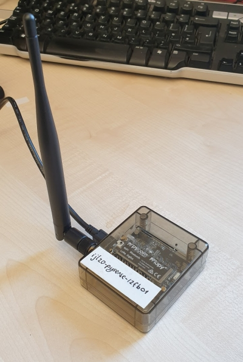

# Pycom Sensors

This repo contains useful information configuring and programing the [Pycom series of IoT dev products](https://pycom.io/).

Pycom dev boards are interesting as they are conveniently programmable in micropython including excellent support for the
networking options (Wifi, LoraWAN, Bluetooth, NB-IoT). The can be powered via USB, or with a LiPo battery, or (in the case
of the Pygate) via PoE.

In general we have an emphasis on using the devices with LoraWAN (i.e. the [LoPy4](https://pycom.io/product/lopy4/) and
[Pygate](https://pycom.io/product/pygate/)) but typically we're configuring these things to talk WiFi or Ethernet also as
part of our development. Note that the Pycom family of products typically use a 'SoC module' (in our case usually a LoPy4)
attached to an expansion board of some kind which may add sensors but also conveniently provides a USB-to-serial connection
to you development workstation which also powers the dev boards. Expansion boards we're using include:
* [Pycom Expansion Board 3.0](https://pycom.io/product/expansion-board-3-0/) providing breakout access to all the SoC pins.
* [Pycom Pysense 2.0X](https://pycom.io/product/pysense-2-0-x/) which adds sensors to temperature, humidity, acceleration, lux.
* [Pycom Pyscan](https://pycom.io/product/pyscan/) which adds sensors for lux, acceleration and an NFC feature.
* [Pycom Pytrack 2.0X](https://pycom.io/product/pytrack-2-0-x/) which includes accelerometer and GPS.
Note purchasing the expansion boards does NOT include the required SoC module (e.g. WiPy or LoPy4)



## Summary of repo contents

This readme (below) has a summary of the 'firmware update' process for BOTH the expansion board (do this first) and
the LoPy4 (or alternative) module used. The components will work out-of-the-box but it's recommended to upgrade them
to the latest firmware before using them

Also in this readme there's a brief discussion of the alternative development tools, i.e. Pymakr (from Pycom),
rshell (3rd party open-source) and mpfshel (3rd-party open source). Each of these provides the same basic
functionality i.e. the ability to transfer files to/from the compute module, and interact with the micropython
interpreter on that compute module (referred to as the REPL loop).

## Install this repo (includes mpfshell):
```
git clone https://github.com/AdaptiveCity/sensor_pycom
cd sensor_pycom
python -m venv venv
source venv/bin/activate
python -m pip install pip --upgrade
python -m pip install wheel
python -m pip install -r requirements.txt
```

## Firmware update

Basically update the expansion board FIRST, without the compute module installed, using `dfu-util`.

Then install / update the compute module (e.g. LoPy4) using `pycom-fwtool`.

### Expansion board

* `sudo apt install dfu-util`
* Firmware download from https://docs.pycom.io/updatefirmware/expansionboard/
* Unplug USB
* Remove LoPy module
* Pre-type command `sudo dfu-util -D <firmware>.dfu`
* Press-and-hold `S1/MCLR` button
* Insert USB, wait 1 second
* Hit `<Enter>` on pre-typed command (within 7 seconds)
* Command should complete with "Done!"

### LoPy module

* Links to Firmware Update Tool https://docs.pycom.io/updatefirmware/device/
* Insert LoPy module into Expansion Board
* Insert USB
* Run firmware update tool with `pycom-fwtool` - follow prompts.
* Re-copy main.py etc to board
* Reset board with button.

## Development tools

Essentially this is TTY access to the 'REPL' interface to MicroPython on the LoPy boards, plus the
ability to upload/download files including `boot.py` and `main.py`. TBH after you get the `>>>` REPL
prompt plus the file xfer ability, these tools are pretty similar.

Note that each of these tools works the same way, i.e. they open a 'serial' connection (via USB) to the
dev board (e.g. LoPy4) and interact with that dev board via the default micropython REPL prompt. File
transfer is effected by injecting the appropriate Python into that REPL loop to achieve the required
effect in the simple dev board file system.

Note that Pycom boards are ALSO capable of supporting FTP access via their WiFi interfaces, and ALSO default
to having 'cloud service' software installed ([pybytes](https://pybytes.pycom.io)) so the dev board can dial back
to pycom via your WiFi network and you can edit and manage your files on the pycom website. For our use we need neither of
these utilities running on the board and we disable them by default during the initial firmware update process.

## mpfshell

https://github.com/wendlers/mpfshell

The latest version (Oct 2021) 1.9.2 has issues that caused it NOT to work on my Ubuntu 20.04 workstation (other people are
reporting the same issue). Downgrading to 1.9.1 worked fine with `pip install mpfshell==0.9.1`

### Notes on Pymakr (from Pycom - install issues with serialport)


https://pycom.io/products/supported-networks/pymakr/

Git repo with useful install tips: https://atom.io/packages/pymakr

This is the 'obvious' choice from pycom. It's an add-on package for Atom or VS Code. A caveat is there are many Node/Python
dependencies (see install tips) and often you need to upgrade/downgrade other software on your workstation.

Personally I prefer the tool to connect to the LoPy NOT integrated into one of my editors.

### Notes on Pybytes (from Pycom)

https://pybytes.pycom.io

This requires a pycom login, and is the 'cloud' version of their dev environment incorporating an online version pf Pymakr. LoPy
boards have built in pybytes support

It relies on the WiFi support built into the LoPy, and the LoPy board will connect back to pycom.io which can then control
your board.

So Pycom provide a fair amount of value-add but it's up to you whether you want your boards to be connecting to pycom or not.

## Notes on rshell

https://github.com/dhylands/rshell

Simple python pip install on your workstation
Pretty old - on my Linux machine this would crash any time I tried transferring files to the LoPy - there are interweb threads
discussing timing issues with the code.
